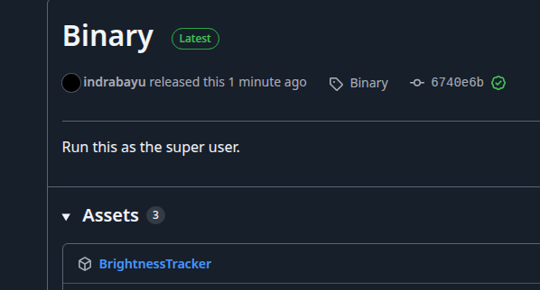
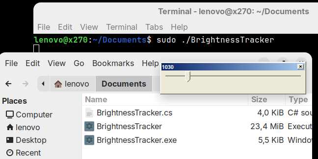

# Brightness Adjustment for Ubuntu

* How to download?

***

* How to run it?

***

The goal is to have a more flexible brightness adjuster for Ubuntu, just like what we can do on Windows.

Please make sure to have both _brightnessctl_ and _Mono_ installed.

1. Reference for **brightnessctl** : https://github.com/Hummer12007/brightnessctl

2. Reference for **Mono** : https://www.mono-project.com/download/stable

In case you want directly to get the binary, [download](https://github.com/indrabayu/BrightnessAdjustmentForUbuntu/releases/download/Binary/BrightnessTracker) it from the Releases section on the right (see the 2nd snip).

Use this prompt on AI such as Google Gemini, ChatGPT, or Microsoft CoPilot to generate the source code:

***

Create for me a minimalist C# Winforms CS file, that has 1 control only of type TrackBar. The min value should be 1 while the max value should be 1000. Make sure the form is packed to show that 1 control only, thus not too wide or to high. Thus having a very minimal area. For every scroll of that TrackBar control, make sure the Title/Text property of the form is updated to show what number it is currently. Make sure the code is compatible with .NET 4.5, and not the current .NET Core 10. Make sure I can compile it with csc compiler instead of using Visual Studio 2026.

Furthermore, let's say now I want to change the "Slider_Scroll" event handler, from (now) just showing the selected value into the Form's title, but also calling a program (via terminal to a certain Windows Program/Process) while passing the selected value (selected TrackBar value) as an argument of that program. Assume I'm running this in Ubuntu instead of Windows, thus please beware of the slash/backslash thing. Assume I want to call something like "brightnessctl set 500", while changing the 500 into the selected value of the TrackBar. Therefore the constructor now should also be adjusted to read the current value of the process by calling "brightnessctl g" and parse the result into an integer. That integer should be the default value of the TrackBar. Directly after that, override the maximum value that TrackBar's maximum value into the actual max value, which is acquired by reading such value of the process by calling "brightnessctl max" and parse the result into an integer, instead of hard-coding it. Then, override that TrackBar's default value with the maximum value in case the default value is bigger than the new maximum value. In case the default value is indeed changed into the new maximum value, do the code (just like in the event handler) to change the current brightness via ""brightnessctl set" using the new maximum value as the argument. Make sure the topmost property of the WinForm is true.  Override the ProcessCmdKey method such that it always return the constant true.

As the first, second, third, and fourth lines of the generated code, make sure to add this the two lines of comment. The first line: "/// INSTALL THESE DEPENDENCIES: sudo apt-get update && sudo apt install -y brightnessctl && sudo apt install -y mono-devel && sudo apt install -y mono-complete". The second line: "/// COMPILE WITH:   mcs /target:winexe /r:System.Windows.Forms.dll /r:System.Drawing.dll /out:BrightnessTracker.exe BrightnessTracker.cs". The third line: "/// DEPLOY WITH:  mkbundle -o BrightnessTracker --simple BrightnessTracker.exe --no-machine-config --no-config". The fourth line: "/// RUN WITH:  sudo ./BrightnessTracker".
